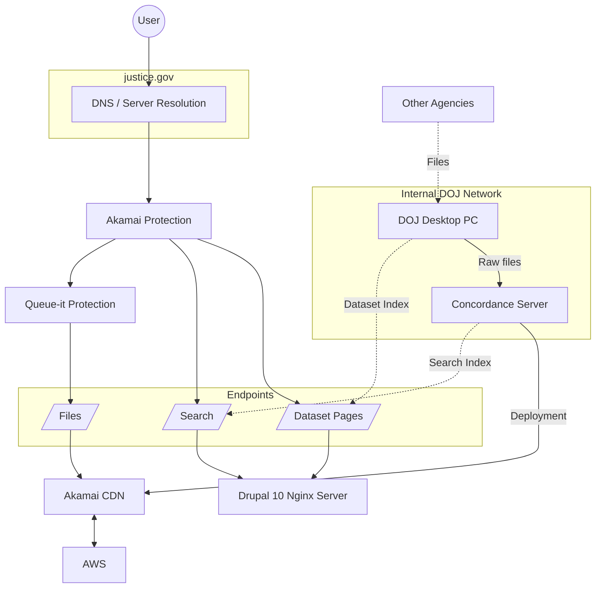

# Structure Overview

The Epstein files are hosted on [justice.gov](https://justice.gov/), the official website of the USA's Department of Justice.

The following Diagramm gives an overview over the Server structure:

