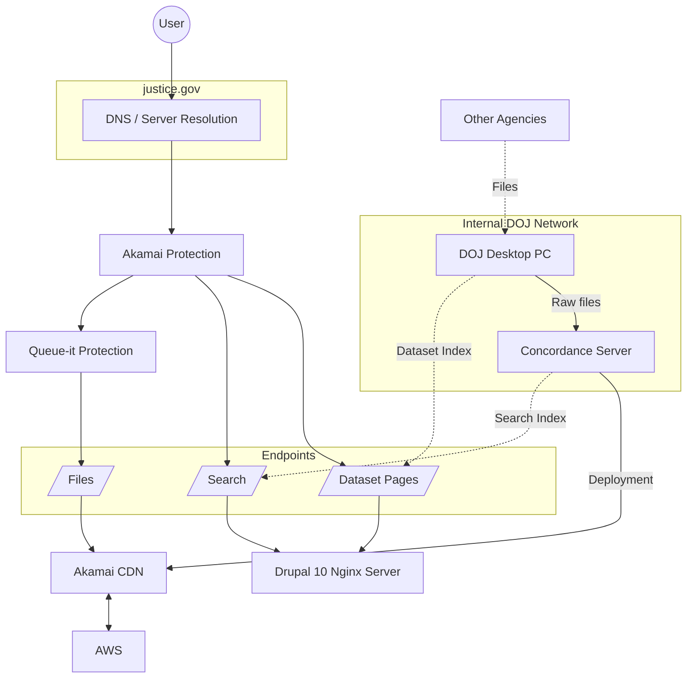

# Structure Overview

The Epstein files are hosted on [justice.gov](https://justice.gov/), the official website of the USA's Department of Justice.

The following diagram gives an overview over the server structure:



## Basic Structure

The platform is split into two distinct hosting environments:

- The main website is hosted on Department of Justice infrastructure (Nginx/ Drupal 10).
- Downloadable files are hosted separately using Akamai’s CDN infrastructure.
- Akamai provides protection, caching, and delivery scaling.
- Internal DOJ systems prepare datasets and publish them externally.

This separation explains why pages, search, and files behave differently when accessed programmatically.

---

## Dataset Pages

Dataset pages are standard website pages served directly from the main **justice.gov** application servers.

### Data origin

Dataset listings are likely manually maintained pages.

- Internal DOJ desktop systems assemble dataset metadata.
- Removal of listings done manually.
- Resulting listings inconsistent with existing files.

### Access behavior

- Page `0` requires no headers or cookies.
- Pages above `page=0` return **403 Forbidden** without browser-like requests.
- Anti-bot filtering now checks for:

  * User-Agent header
  * Additional headers
  * Presence of any cookie (value and name do not matter)

Example request:

```bash
curl -I 'https://www.justice.gov/epstein/doj-disclosures/data-set-1-files?page=1' \
  -H 'accept-language:e' \
  -b 'A=A' \
  -H 'y:u' \
  -H 'e:?' \
  -H 'user-agent: Mozilla/4.0 (x11; linux x'
```

## Search

The search endpoint functions as a public API exposed through the main website infrastructure.

### Request flow

1. User request passes Akamai protection.
2. Request reaches the Drupal/Nginx application server.
3. Results are generated using an internally produced search index.

### Data origin

- The Concordance server generates search indexes.
- These indexes are exported and connected to the public multimedia search endpoint.

### Endpoint format

```
/multimedia-search?keys=query&page=1
```

### Access requirements

The endpoint requires specific headers to bypass filtering.

Example:

```bash
curl 'https://www.justice.gov/multimedia-search?keys=query&page=1' \
  -H 'y:u' \
  -H 'e:?' \
  -H 'user-agent: Mozilla/5.0 (X11; Linux x'
```

---

## Files

File downloads are completely separated from the DOJ web servers.

### Request flow


User -> DNS -> Akamai Protection -> Queue-it -> Akamai CDN -> AWS storage


### Hosting model

- Additional Queue-it protection.
- Files are delivered via Akamai CDN.
- Backend storage is synchronized with AWS infrastructure.
- DOJ internal systems deploy files to the CDN through the Concordance server.

### Internal pipeline

1. Other agencies provide raw files.
2. Files are transferred to DOJ internal machines.
3. Concordance organizes and prepares datasets.
4. Files are deployed to Akamai CDN.
5. CDN distributes files globally.

### Queue protection

Queue-it acts as a traffic gate before file delivery, preventing large-scale simultaneous downloads.

### Access requirements

Files require an age verification cookie:

```bash
curl -I "https://www.justice.gov/epstein/files/DataSet%201/EFTA00000001.pdf" \
  -b "justiceGovAgeVerified=true"
```

Without this cookie, the response code is 302 and contains a reditrect to the age verification page, regardless if the page requested exists or not.

### Operational implications

- DOJ servers do not directly serve PDFs.
- Akamai handles caching and scaling.
- AWS acts as storage used by Akamai.

